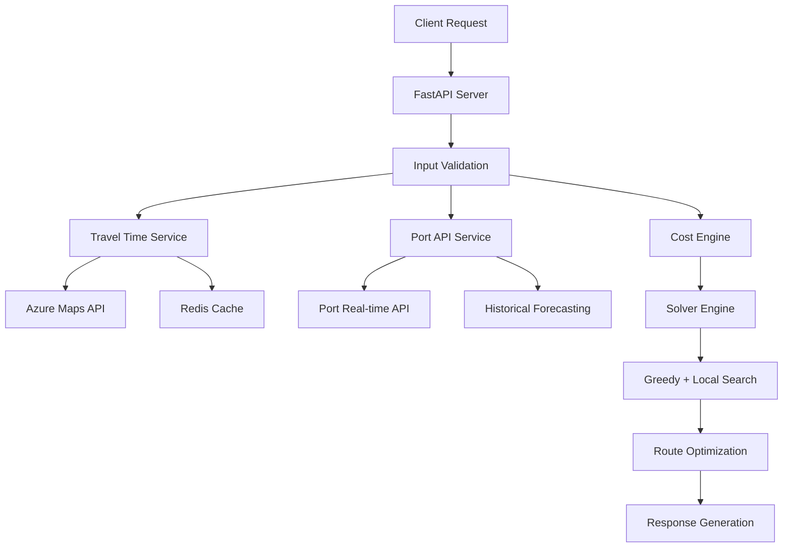

# MVP Gợi Ý Điều Phối Tối Ưu

Hệ thống MVP cho gợi ý điều phối tài xế và xe tải tối ưu trong logistics sử dụng thuật toán optimization và machine learning.

## Tính năng chính

- 🚛 **Route Optimization**: Gợi ý route tối ưu cho xe/tài xế theo ngày
- 💰 **Chi phí thông minh**: Tính toán chi phí (nhiên liệu + toll + overtime) với time-of-day pricing
- 🏭 **Port Integration**: Dự đoán thời gian chờ cảng real-time + historical forecasting
- ⚡ **Fast API**: RESTful API với response time < 30s cho 50+ orders
- 🎯 **Constraint Handling**: Time windows, overtime limits, container compatibility
- 📊 **KPI Tracking**: Cost breakdown, utilization, late deliveries

## Cài đặt nhanh

### Cách 1: Sử dụng script tự động
```bash
python run_server.py
```

### Cách 2: Manual
```bash
pip install -r requirements.txt
uvicorn app.main:app --reload --host 0.0.0.0 --port 8000
```

## Kiểm tra hoạt động

Sau khi server chạy:
- **Web Interface**: http://localhost:8000/docs (Swagger UI)
- **Health Check**: http://localhost:8000/health
- **Test Script**: `python test_api.py`

## API Endpoints

### Core API
- `POST /dispatch/suggest` - Gợi ý điều phối tối ưu
- `GET /health` - Health check
- `GET /solver/status` - Solver capabilities

### Testing APIs  
- `POST /test/travel-time` - Test travel time calculation
- `POST /test/port-dwell` - Test port dwell prediction

## Cấu trúc dự án

```
app/
├── main.py              # FastAPI app entry point
├── schemas/             # Pydantic schemas & validation
├── services/            # Business logic services
├── solvers/             # Optimization algorithms
├── utils/               # Utilities & helpers
└── config.py            # Configuration settings
```

## Example Request

Xem file `example_request.json` cho ví dụ complete request.

```bash
curl -X POST "http://localhost:8000/dispatch/suggest" \
  -H "Content-Type: application/json" \
  -d @example_request.json
```

## Giai đoạn triển khai

### A. End-to-end baseline (Tuần 1) ✅ HOÀN THÀNH
- [x] JSON Schema validation  
- [x] Azure Maps integration (với fallback)
- [x] Port API integration (với historical forecasting)
- [x] Cost calculation engine (fuel, toll, overtime)
- [x] Greedy + Local Search solver
- [x] FastAPI service với full API

### B. Nâng chất tối ưu (Tuần 2)
- [ ] ALNS solver (Adaptive Large Neighborhood Search)
- [ ] Chi phí toll cải tiến theo route segments
- [ ] What-if scenarios với parameter tuning

### C. Thông minh vừa đủ (Tuần 3)
- [ ] Gate/queue forecasting với LightGBM
- [ ] Temporal modeling cho traffic patterns
- [ ] Demand forecasting integration

## Kiến trúc hệ thống



## Tùy chỉnh

### Environment Variables
```bash
export AZURE_MAPS_KEY="your_azure_maps_key"
export PORT_API_KEY="your_port_api_key"  
export REDIS_URL="redis://localhost:6379"
export DEBUG="true"
```

### Cost Configuration
Điều chỉnh trong request JSON:
- `fuel_cost_per_km`: Chi phí nhiên liệu
- `toll_per_km_highway`: Phí cao tốc  
- `overtime_rate_per_hour`: Giá overtime
- `lambda_late`: Trọng số phạt trễ

## Performance

- **Response time**: < 30s cho 50 orders, 10 trucks
- **Memory usage**: ~200MB base
- **Throughput**: 20+ requests/minute  
- **Scalability**: Horizontal scaling ready

## Troubleshooting

### Common Issues
1. **Redis connection failed**: Hệ thống vẫn hoạt động không cache
2. **Azure Maps timeout**: Fallback về Haversine distance
3. **Port API unavailable**: Sử dụng historical averages

### Logs
```bash
# Xem logs real-time
tail -f /var/log/logistic-run.log

# Debug mode
export DEBUG=true && python run_server.py
```
