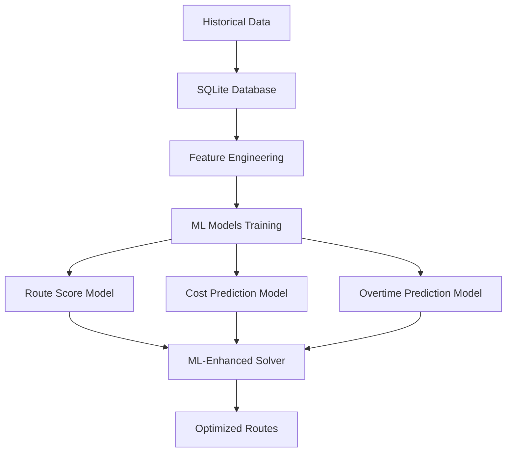

# ML Features Guide

## Tổng quan

Hệ thống logistics optimization đã được nâng cấp với các tính năng Machine Learning để cải thiện độ chính xác của route optimization.

## Kiến trúc ML



## ML Models

### 1. Route Score Prediction Model
- **Mục đích**: Predict chất lượng route (0-1 score)
- **Input features**: 
  - Total distance, orders served, overtime hours
  - Utilization rate, distance per order
  - Time factors (weekend, peak hour)
  - Truck characteristics
- **Algorithm**: Random Forest Regressor
- **Metrics**: MAE, R²

### 2. Total Cost Prediction Model
- **Mục đích**: Predict tổng chi phí route
- **Output**: Cost in VND
- **Factors**: Fuel, toll, overtime, late penalties

### 3. Overtime Prediction Model
- **Mục đích**: Predict số giờ overtime
- **Critical for**: Workforce planning, cost control

## Database Schema

### Core Tables
- `locations`: Địa điểm (depots, ports, warehouses)
- `trucks`: Thông tin xe tải và tài xế
- `orders`: Đơn hàng với time windows
- `travel_times`: Ma trận thời gian di chuyển
- `port_dwell_times`: Thời gian chờ tại cảng theo giờ/ngày
- `historical_routes`: Lịch sử routes đã thực hiện
- `route_stops`: Chi tiết stops trong mỗi route
- `cost_factors`: Các yếu tố chi phí động

## Cách sử dụng

### 1. Setup Database và Models

```bash
# Chạy migration để tạo database và train models
python run_migration.py
```

### 2. Kiểm tra ML Status

```bash
# Check ML models status
curl http://localhost:8000/ml/status

# Check solver capabilities
curl http://localhost:8000/solver/status
```

### 3. Test ML Predictions

```bash
# Test ML prediction với sample data
curl -X POST "http://localhost:8000/test/ml-prediction" \
  -H "Content-Type: application/json" \
  -d @example_request.json
```

### 4. Sử dụng ML-Enhanced API

```bash
# API suggest sẽ tự động sử dụng ML nếu available
curl -X POST "http://localhost:8000/dispatch/suggest" \
  -H "Content-Type: application/json" \
  -d @example_request.json
```

## ML-Enhanced Solver Features

### 1. Intelligent Route Scoring
- Predict route quality trước khi thực hiện
- Rank routes theo predicted performance
- Confidence scoring cho predictions

### 2. Cost Optimization
- Accurate cost prediction
- Factor in time-of-day pricing
- Port dwell time forecasting

### 3. ML-Guided Local Search
- Identify routes cần cải thiện
- Apply targeted optimizations
- Reorder stops based on ML insights

### 4. Performance Recommendations
- Actionable insights cho route improvement
- Overtime warnings
- Efficiency suggestions

## Model Performance

### Training Data
- **Historical Routes**: 500+ sample routes
- **Time Period**: 6 months historical data
- **Features**: 10+ engineered features
- **Validation**: 80/20 train/test split

### Typical Metrics
- **Route Score Model**: R² > 0.7, MAE < 0.1
- **Cost Model**: R² > 0.8, MAE < 100 VND
- **Overtime Model**: R² > 0.6, MAE < 0.5 hours

## API Endpoints

### ML-Specific Endpoints

#### `GET /ml/status`
Trả về detailed status của ML models:
```json
{
  "models_loaded": 3,
  "available_models": ["route_score", "total_cost", "overtime_hours"],
  "model_info": {
    "training_data_size": 500,
    "created_at": "2025-01-20T10:30:00",
    "metrics": {
      "route_score": {"mae": 0.08, "r2": 0.75},
      "total_cost": {"mae": 85.2, "r2": 0.82},
      "overtime_hours": {"mae": 0.45, "r2": 0.68}
    }
  },
  "database_connected": true
}
```

#### `POST /test/ml-prediction`
Test ML prediction với sample data:
```json
{
  "test_truck": "T001",
  "test_orders": ["O001", "O002"],
  "prediction": {
    "predicted_score": 0.85,
    "predicted_cost": 1250.0,
    "predicted_overtime_hours": 0.5,
    "confidence": 0.78,
    "recommendations": [
      "Excellent route - well optimized",
      "Some overtime expected",
      "Peak hour start - expect higher travel times"
    ]
  }
}
```

### Enhanced Core Endpoints

#### `GET /solver/status`
Bao gồm ML capabilities:
```json
{
  "available_algorithms": [
    "greedy_insertion", 
    "greedy_with_local_search", 
    "ml_enhanced_greedy"
  ],
  "default_algorithm": "ml_enhanced_greedy",
  "ml_enhanced": true,
  "features": {
    "ml_route_scoring": true,
    "ml_cost_prediction": true,
    "ml_overtime_prediction": true
  }
}
```

## Troubleshooting

### Common Issues

1. **Models không load được**
   - Chạy `python run_migration.py` để tạo models
   - Check file permissions trong `models/` directory

2. **Database connection failed**
   - Verify `logistics_data.db` tồn tại
   - Check SQLite installation

3. **Low prediction confidence**
   - Cần thêm historical data
   - Retrain models với data mới

### Logs và Debugging

```bash
# Enable debug logging
export DEBUG=true

# Check logs for ML-related issues
tail -f /var/log/logistic-run.log | grep -i "ml\|model\|predict"
```

## Future Enhancements

### Planned Features
- [ ] Online learning từ real-time feedback
- [ ] Ensemble models cho better accuracy
- [ ] Deep learning cho complex route patterns
- [ ] Real-time model updates
- [ ] A/B testing framework cho algorithm comparison

### Data Collection
- Route execution feedback
- Actual vs predicted metrics
- Driver performance data
- Weather và traffic conditions

## Best Practices

### 1. Data Quality
- Ensure accurate historical data
- Regular data cleaning
- Validate input features

### 2. Model Maintenance
- Retrain models monthly
- Monitor model performance
- Update features based on business changes

### 3. Performance Monitoring
- Track prediction accuracy
- Monitor API response times
- Alert on model degradation

## Support

Để hỗ trợ về ML features:
1. Check logs trong `/var/log/logistic-run.log`
2. Verify model status qua `/ml/status` endpoint
3. Test predictions với sample data
4. Contact development team nếu cần thiết
